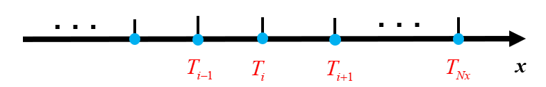
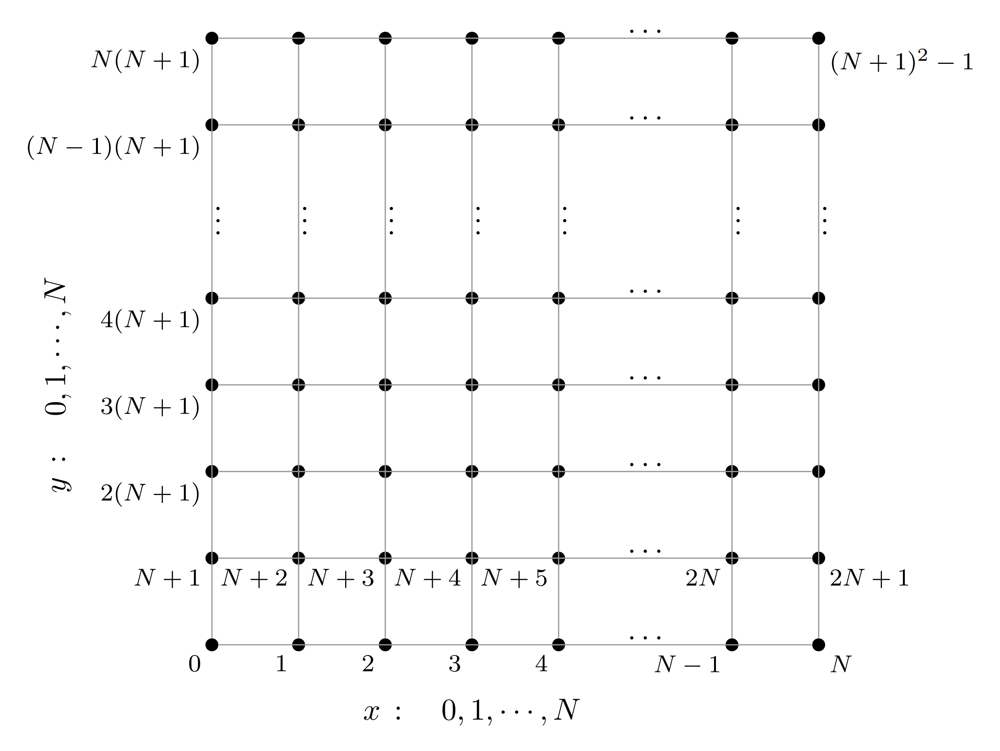
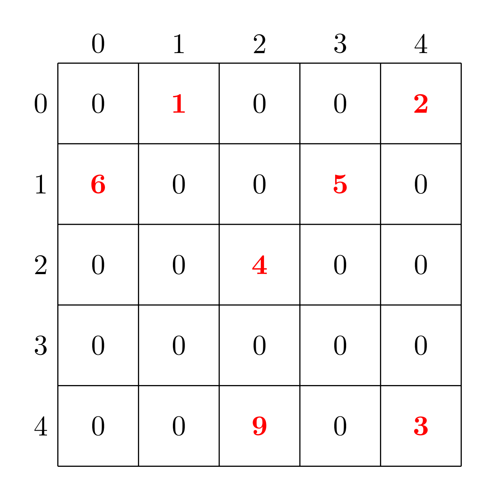

# 决赛培训: 数值计算求解中子扩散方程

> 查看决赛培训的[回放与文件](https://cfile.thudep.com:7100/11/final).

## 有限差分法

### 问题背景

考虑一个常系数稳态扩散方程

$$
- \lambda \nabla^2 T = f
$$

式中的 $T$ 为待求的场 (如温度场), $f$ 是已知的源项, $\lambda$ 是扩散系数, 在这里设常数, $\nabla^2$ 是 Laplace 算子, 在 $n$ 维空间中, 其含义为

$$
\nabla^2 T = \sum_{i=1}^{n} \frac{\partial^2 T}{\partial x_{i}^2}
$$

先考虑一维的情形, 则上述方程可写为

$$
- \lambda \frac{\mathrm{d}^2}{\mathrm{d} x^2} T(x) = f(x)
$$

对于比较复杂的方程形式或者比较复杂的源项 $f(x)$ , 可能无法简单地求出解析解, 在此情况下, 可以尝试求上述方程的**数值解**.

所谓**有限差分法**, 就是将求解域划分为差分**网格**, 用有限个网格节点代替连续的求解域, 把导数用网格节点上的函数值的差商代替进行离散, 建立以网格节点上的值为未知数的代数方程组, 从而将微分问题变为代数问题, 从而可利用计算机求解.

### 一维问题的网格划分与导数表示

有限差分法所研究的节点位于网格顶点 (与此相对, 有限体积法的节点位于网格中心), 下图即为一个一维的网格划分示意图:



假设划分的网格是均匀的 (在决赛题目中亦遵从此假设), 每两个节点的间距为 $h$ , 以 $T_i$ 点为研究对象, 其一阶导数可表示为

$$
T'_i \approx \frac{T_{i+1} - T_{i}}{h}
\\ \ \\
T'_i \approx \frac{T_{i} - T_{i-1}}{h}
$$

这两种表达可分别被称为前向导数与后向导数. 二阶导数可以表示为

$$
T''_i \approx \frac{T_{i+1} - 2 T_{i} + T_{i-1}}{h^2}
$$

这样, 上述一维常系数稳态扩散方程则可写为离散化的形式

$$
- \frac{\lambda}{h^2} T_{i+1} + \frac{2 \lambda}{h^2} T_{i} - \frac{\lambda}{h^2} T_{i-1} = f_i
$$

但是, 对于边界处的点, 一般需要额外处理, 即**边界条件**. 在决赛中, 我们所用的是**第一类边界条件** (Dirichlet 边界条件), 即边界处的值为 $0$ , 即

$$
T_{0} = T_{N_x} = 0
$$

这样, 由上述 $N_{x} - 1$ 个内部方程, 与 $2$ 个边界方程, 即组成了一个由 $N_{x} + 1$ 个方程组成的线性方程组, 求解该线性方程组, 得到的解向量即为所有节点处的 $T$ 值.

### 有限差分法的精度分析

有限差分法的精度, 可以通过泰勒展开来分析, 以上述问题为例, 由泰勒展开可得

$$
T_{i+1} = T_{i} + \frac{1}{1!} \frac{\mathrm{d} T_{i}}{\mathrm{d} x} h + \frac{1}{2!} \frac{\mathrm{d}^2 T_{i}}{\mathrm{d} x^2} h^2 + \frac{1}{3!} \frac{\mathrm{d}^3 T_{i}}{\mathrm{d} x^3} h^3 + \frac{1}{4!} \frac{\mathrm{d}^4 T_{i}}{\mathrm{d} x^4} h^4 + O(h^5)
\\ \ \\
T_{i-1} = T_{i} - \frac{1}{1!} \frac{\mathrm{d} T_{i}}{\mathrm{d} x} h + \frac{1}{2!} \frac{\mathrm{d}^2 T_{i}}{\mathrm{d} x^2} h^2 - \frac{1}{3!} \frac{\mathrm{d}^3 T_{i}}{\mathrm{d} x^3} h^3 + \frac{1}{4!} \frac{\mathrm{d}^4 T_{i}}{\mathrm{d} x^4} h^4 + O(h^5)
$$

将其代入差分的表达式, 可得

$$
\frac{T_{i+1} - 2 T_{i} + T_{i-1}}{h^2} = \frac{\mathrm{d}^2 T_{i}}{\mathrm{d} x^2} + \frac{1}{12} \frac{\mathrm{d}^4 T_{i}}{\mathrm{d} x^4} h^2 + O(h^3)
$$

将其代入原始方程, 可得

$$
- \lambda \frac{\mathrm{d}^2 T_i}{\mathrm{d} x^2} - f_i
= - \lambda \frac{\mathrm{d}^2 T_i}{\mathrm{d} x^2} + \lambda \frac{T_{i+1} - 2 T_{i} + T_{i-1}}{h^2}
= \frac{\lambda}{12} \frac{\mathrm{d}^4 T_{i}}{\mathrm{d} x^4} h^2 + O(h^3)
$$

由此可见, 该离散格式在空间上是二阶精度的.

通过选取更多的节点来表示导数, 可以获得更高精度的离散格式, 在决赛题目中, 由于限定了离散格式, 并以限定的离散格式来评分, 所以请**不要更改离散格式**, 否则即使更接近真实情况, 分数也会更低.

### 二维问题的网格划分与拉普拉斯算符表示

二维问题与一维问题类似, 首先, 我们需要把一个二维的平面用一维的向量来表示, 采用下图所示的方式为节点编号 (从 `0` 开始):



二维的拉普拉斯算符为

$$
\nabla^2 = \frac{\partial^2}{\partial x^2} + \frac{\partial^2}{\partial y^2}
$$

采用**五点差分格式**进行离散, 使用 $[i, j]$ 表示编号为 $i + j(N+1)$ 的格点, 记 $\mathrm{d} x = \mathrm{d} y = h$ , 则对于内部节点:

$$
\left(\nabla^2 T\right)_{[i, j]} = \frac{T_{[i-1, j]} + T_{[i+1, j]} + T_{[i, j-1]} + T_{[i, j+1]}  -4 T_{[i, j]}}{h^2}
$$

对于**第一类边界条件**, 有

$$
T_{[0, j]} = T_{[N, j]} = T_{[i, 0]} = T_{[i, N]} = 0
$$

## 中子扩散方程

### 单群中子扩散方程

常系数单群中子扩散方程为:

$$
\frac{\partial n}{\partial t}
= \frac{1}{v} \frac{\partial \phi(\vec{r}, t)}{\partial t}
= S(\vec{r}, t) + D \nabla^2 \phi(\vec{r}, t) - \Sigma_{\text{a}} \phi(\vec{r}, t)
$$

式中 $n$ 为中子数密度, $v$ 为中子速度, $\phi = n v$ 为中子通量密度, $S$ 为中子源项, $D$ 为扩散系数, $\Sigma_{\text{a}}$ 为中子宏观吸收截面.

对于上述中子扩散方程:

- 左侧表示中子数密度的变化.
- 右侧第一项 $S(\vec{r}, t)$ 为中子的产生项, 在具体反应堆中, 由裂变反应产生, 与中子通量密度 $\phi$ 有关, 这里假定研究的区域是一个无裂变的区域, 中子源呈与中子通量密度相独立的分布.
- 右侧第二项 $D \nabla^2 \phi(\vec{r}, t)$ 为中子的泄露项, 就其推导而言, 其原始形式为 $- \nabla \cdot \vec{J}(\vec{r}, t)$ , 根据菲克定律, 中子流 $\vec{J} = - D \nabla \phi$ , 当扩散系数 $D$ 为常数时, 即得到该项表达式.
- 右侧第三项 $- \Sigma_{\text{a}} \phi(\vec{r}, t)$ 为中子的吸收项, 同样假定空间物质分布是均匀的, 物质的宏观吸收截面为常数.

当上述方程左侧为 $0$ 时, 即变为稳态常系数单群中子扩散方程:

$$
- D \nabla^2 \phi(\vec{r}) + \Sigma_{\text{a}} \phi(\vec{r}) = S(\vec{r}) 
$$

该方程的含义即为 $\text{泄露项} + \text{吸收项} = \text{产生项}$ . 决赛的前一半分数, 即为该方程的离散求解.

### 双群中子扩散方程

在实际的反应堆问题中, 中子的能量是有一定的分布的, 且扩散系数与宏观吸收截面等参数是与能量有关的. 为了更细致的刻画中子通量密度的分布, 常采用的方法是把整个能量区间**划分为若干区**, 对每个区写出一个中子扩散方程, 上述的与能量有关的参数则取区间内的平均值, 称为**群常数**. 最简单的划分方式即划分为**双群**, 即高能的**快群**与低能的**热群**. 

划分为双群后, 中子扩散方程也会发生一定的变化, 需要增加中子在两群中转移的项, 用两个散射转移截面 $\Sigma_{1\to2}, \Sigma_{2\to1}$ 来表征. 在理论上, 反应堆中的中子发生散射后能量会降低, 也就是说通常只有快群向热群的散射, 而热群向快群的散射是难以发生的, 即 $\Sigma_{2\to1}$ 是接近于 $0$ 的, 但是为了使两群的中子扩散方程耦合 (在实际的反应堆问题中, 热中子发生链式反应后会产生快中子), 在决赛中假定 $\Sigma_{2\to1}$ 是非零的.

假定中子源产生的都是快中子, 则稳态常系数双群中子扩散方程为:

$$
- D_1 \nabla^2 \phi_1(\vec{r}) + \Sigma_{\text{a}1} \phi_1(\vec{r}) + \Sigma_{1\to2} \phi_1(\vec{r}) - \Sigma_{2\to1} \phi_2(\vec{r}) = S(\vec{r})
\\ \ \\
- D_2 \nabla^2 \phi_2(\vec{r}) + \Sigma_{\text{a}2} \phi_2(\vec{r}) + \Sigma_{2\to1} \phi_2(\vec{r}) - \Sigma_{1\to2} \phi_1(\vec{r}) = 0
$$

对于该方程组, 不难发现任何一个方程都无法独立求解, 为了求解该方程组, 有以下两种思路:

- **分离求解**: 使用 **Picard 迭代**方法, 求解一个方程时, 将一个物理场视为未知量, 其他物理场视为常数, 不同方程之间不断迭代, 并传递耦合参数, 直到收敛.
- **耦合求解**: 将每个方程离散得到矩阵组合起来, 形成的分块矩阵每一块表示物理场之间的耦合, 对这个矩阵进行**整体求解**.

## 稀疏矩阵

### 稀疏矩阵的定义

**稀疏矩阵 (sparse matrix)** 是一种元素大部分为零的矩阵, 反之, 如果大部分元素都非零, 则称矩阵是**稠密 (dense)** 的.

对于一个 $n$ 阶的方阵, 假设每行的平均非零元素数目为 $d$ , 则使用稠密矩阵的方式存储所消耗的空间为 $O(n^2)$ , 而稀疏矩阵只存储非零元素的信息, 所消耗的空间为 $O(nd)$ . 一般来讲, $d \ll n$ , 这样稀疏矩阵可以大大减少存储所用的空间, 同时也在一定程度上加快了相对应的运算速度.

对于上述的 PDE 离散后形成的线性方程组, 非耦合的条件下每行至多有 $5$ 个非零元素, 对于双群理论的耦合方程组, 每行至多有 $6$ 个非零元素, 明显是稀疏矩阵.

### 稀疏矩阵的存储格式

#### COO 格式

**COO 格式 (Coordinate list)** 存储一个 `(行, 列, 值)` (`(row, column, value)`) 元组的列表. 在具体的 `C/C++` 实现中: 可以创建一个含有 `r, c, v` 三个元素的结构体, 然后用一个结构体数组来存储; 也可以直接创建三个数组 `row, col, val` 来存储矩阵信息, 这时需要保证元素的对应关系, 即 `row[i], col[i], val[i]` 对应的是同一个矩阵元的信息.

在理想情况下, 条目应先按行索引排序, 再按列索引排序, 这样可以方便矩阵元素的修改维护, 也可以方便计算. 假设 COO 中存储了 `n` 个矩阵元素的信息, 则随机的添加/删除/修改一个元素, 所需的平均时间复杂度为 $O(n)$ , 对于工程化的实现, 如果想要尽可能降低随机修改的时间消耗, 可以使用 **DOK 格式 (Dictionary of keys)**, 即使用**词典 ( 散列表 )** 来存储矩阵元素, 可以使用该格式进行矩阵的构建, 然后再转化为便于计算的格式.

一个稀疏矩阵的例子如下:



用 COO 格式表示为:

- `row`: `0`, `0`, `1`, `1`, `2`, `4`, `4`; 
- `col`: `1`, `4`, `0`, `3`, `2`, `2`, `4`;
- `val`: `1`, `2`, `6`, `5`, `4`, `9`, `3`.

#### CSR/CSC 格式

**CSR 格式 (compressed sparse row, 压缩行储存)** 和 **CSC 格式(compressed sparse column, 压缩列储存)** 是另外两种常用的稀疏矩阵储存方法. 以 CSR 为例, 矩阵被分为三个数组: 行指针 `row` , 列索引 `col` 和值 `val`,  行指针数组记录每行的起始位置 (`row[i+1] - row[i]` 即为第 `i` 行的非零元素数目) , 列索引数组存储每个非零元素的列索引, 值数组包含相应的非零元素值; CSC 格式与此类似.

CSR/CSC 格式与 COO/DOK 格式相比, 对顺序性有着较强的要求, 不适用于矩阵的构建 (当然, 如果已知矩阵的内容, 也可以直接按顺序强行构建); CSR/CSC 格式对于快速访问与计算有优势.

对于上述的稀疏矩阵, 用 CSR 格式表示为:

- `row`: `0`, `2`, `4`, `5`, `5`, `7`; 
- `col`: `1`, `4`, `0`, `3`, `2`, `2`, `4`;
- `val`: `1`, `2`, `6`, `5`, `4`, `9`, `3`.

用 CSC 格式表示为:

- `row`: `0`, `0`, `1`, `1`, `2`, `4`, `4`; 
- `col`: `0`, `1`, `2`, `4`, `5`, `7`; 
- `val`: `1`, `2`, `6`, `5`, `4`, `9`, `3`.

### 稀疏矩阵的运算

稀疏矩阵涉及的元素, 主要是**稀疏矩阵向量乘 (Sparse matrix–vector multiplication, SpMV)**. 以 COO 格式为例, 假设使用 `row, col, val` 三个数组来存储非零元素信息, 用 `nnz` 来表示非零元素数目, 则 $\vec{y} = A \vec{x}$ 的代码如下 (假定大小匹配且 `y` 各元素初值为`0`) : 
```c
for(int i = 0; i < nnz; i++){
    y[row[i]] += val[i] * x[col[i]];
}
```

## 线性方程组迭代求解器

决赛**要求**使用以迭代法为基础的算法求解线性方程组.

### 迭代求解的基本思想

对于一个稠密矩阵构成的小规模线性方程组, 我们在线性代数课程中学习过高斯消元法或 LU 分解法, 这种**直接法**在确定的时间内能够求出准确的解 (忽略计算机的舍入误差因素), 对于一个 $n$ 阶的方阵, 其时间复杂度为 $O(n^3)$ .

但是, 对于稀疏矩阵构成的大规模线性方程组, 如果仍然采用上述的直接法求解, 则会破坏掉矩阵的稀疏性, 在内存有限的条件下无法满足需求, 且计算效率与准确度均无法得到保证, 这时使用**迭代法**能够更好的解决问题.

迭代法的基本思想, 就是对于方程组 $A \vec{x} = \vec{b}$ , 其中 $A \in \mathbb{R}^{n \times n}$ 且可逆, $\vec{b} \in \mathbb{R}^{n}$ , 可以把矩阵 $A$ 分裂为 $A = M - N$ , 其中 $M$ 是一个方便求逆的矩阵, 则

$$
M \vec{x} = \vec{b} + N \vec{x}
\Longleftrightarrow
\vec{x} = M^{-1} ( \vec{b} + N \vec{x} )
$$

这样, 原方程可以等价的表示为一个迭代过程

$$
\vec{x}^{(k+1)} = B \vec{x}^{(k)} + \vec{f}
$$

其中 $B = M^{-1} N = I - M^{-1} A$ , $\vec{f} = M^{-1} \vec{b}$ . 如果迭代矩阵 $B$ 保持不变, 则称为**定常迭代法**.

可以证明, 若该迭代序列收敛, 则 $\lim_{k \to \infty} x^{(k)} = x^{*}$ 是原方程组的解. 迭代收敛的充要条件是, 迭代矩阵的谱半径满足

$$
\rho(B) = \max_{\lambda \in \sigma(B)} |\lambda| < 1
$$

充分条件是, 迭代矩阵的谱范数 (矩阵的谱半径不大于任意矩阵范数) 满足

$$
\|B\|_2 = \max_{\|\vec{x}\| = 1} \|B \vec{x}\| = \sqrt{\rho(B^T B)} < 1
$$

### 简单的迭代求解器

#### Jacobi 迭代法

若系数矩阵 $A$ 的对角线元素不全为 $0$ , 则可分解为

$$
A = D - (L + U)
$$

其中 $D$ 为 $A$ 的对角元素所构成的对角矩阵, $L$ 为严格下三角矩阵, $U$ 为严格上三角矩阵, 则 Jacobi 迭代法的迭代公式为

$$
\vec{x}^{(k+1)} = (I - D^{-1} A) \vec{x}^{(k)} + D^{-1} \vec{b}
$$

用矩阵元的形式可写为

$$
x_{i}^{(k+1)} = \frac{1}{a_{ii}} \left( b_i - \sum_{j = 1, j \ne i}^{n} a_{ij} x_{j}^{(k)} \right)
$$

每步迭代中 $i$ 从 $1$ 到 $n$ 可并行计算.

如果 $A$ 严格对角占优, 则可以证明 Jacobi 迭代法收敛.

#### Gauss-Seidel 迭代法

若系数矩阵 $A$ 的对角线元素不全为 $0$ , 则可分解为

$$
A = (D - L) - U
$$

其中 $D$ 为 $A$ 的对角元素所构成的对角矩阵, $L$ 为严格下三角矩阵, $U$ 为严格上三角矩阵, 则 Gauss-Seidel 迭代法的迭代公式为

$$
\vec{x}^{(k+1)} = (D - L)^{-1} U \vec{x}^{(k)} + (D - L)^{-1} \vec{b}
$$

用矩阵元的形式可写为

$$
x_{i}^{(k+1)} = \frac{1}{a_{ii}} \left( b_i - \sum_{j = 1}^{i-1} a_{ij} x_{j}^{(k+1)} - \sum_{j = i+1}^{n} a_{ij} x_{j}^{(k)} \right)
$$

每步迭代中 $i$ 从 $1$ 到 $n$ 需按序计算.

如果 $A$ 严格对角占优, 则可以证明 Gauss-Seidel 迭代法收敛.

#### SOR 迭代法

若系数矩阵 $A$ 的对角线元素不全为 $0$ , 引入松弛因子 $\omega \in (0, 2)$ , 则 $A$ 可分解为

$$
A = \left( \frac{1}{\omega} D - L \right) - \left( \frac{1 - \omega}{\omega} D + U \right)
$$

其中 $D$ 为 $A$ 的对角元素所构成的对角矩阵, $L$ 为严格下三角矩阵, $U$ 为严格上三角矩阵, 则 SOR 迭代法 (松弛法) 的迭代公式为

$$
\vec{x}^{(k+1)} = (D - \omega L)^{-1} [ (1 - \omega) D + \omega U ] \vec{x}^{(k)} + \omega (D - \omega L)^{-1} \vec{b}
$$

用矩阵元的形式可写为

$$
x_{i}^{(k+1)} = (1 - \omega) x_{i}^{(k)} + \frac{\omega}{a_{ii}} \left( b_i - \sum_{j = 1}^{i-1} a_{ij} x_{j}^{(k+1)} - \sum_{j = i+1}^{n} a_{ij} x_{j}^{(k)} \right)
$$

每步迭代中 $i$ 从 $1$ 到 $n$ 需按序计算.

### 收敛速度分析

迭代法第 $k$ 步的收敛误差为

$$
\vec{\varepsilon}^{\,(k)} = \vec{x}^{(k)} - \vec{x}^{*} = B^{k} (\vec{x}^{(0)} - \vec{x}^{*}) = B^{k} \vec{\varepsilon}^{\,(0)}
$$

所以

$$
\frac{\|\vec{\varepsilon}^{\,(k)}\|}{\|\vec{\varepsilon}^{\,(0)}\|} < \|B^{k}\|
$$

因此平均每次迭代后误差的压缩率为 $\|B^{k}\|^{1/k}$ , 定义平均收敛速度为:

$$
R_{k}(B) = - \ln \|B^{k}\|^{1/k}
$$

渐进收敛速度定义为

$$
R(B) = \lim_{k \to \infty} R_{k}(B) = - \ln \rho(B)
$$

如果 $0 < \rho(B) < 1$ , 则线性收敛; 且一般来说, $\rho(B)$ 越小, 收敛速度越快.

一般情况下 Gauss-Seidel 比 Jacobi 的 $\rho(B)$ 更小, 收敛速度更快; 对于 SOR 迭代法, 当 $\omega = 1$ 时退化为 Gauss-Seidel 迭代, 为使迭代速度最快, 可以选取最佳松弛因子

$$
\omega_{\text{opt}} = \frac{2}{1 + \sqrt{1 - [\rho(I - D^{-1} A)]^2}}
$$

### 其它的迭代求解方法

- **代数多重网格**法 (Algebraic Multigrid, AMG): 先用简单迭代 (平滑器) 快速消掉解中的高频误差, 再把问题投影到粗网格上去处理低频误差, 通过多层网格循环, 使所有误差都被快速消除, 从而高效求解大型稀疏线性方程组.
- **Krylov 子空间**法: 猜测一个初始解 $\vec{x}_0$ , 从初始残差 $\vec{r}_0 = \vec{b} - A \vec{x}_{0}$ 出发，构造由 $\vec{r}_0, A \vec{r}_0, A^2 \vec{r}_0 \cdots$ 生成的 Krylov 子空间, 在这个子空间里逐步寻找最优解, 通过迭代不断减小残差, 直至收敛.
